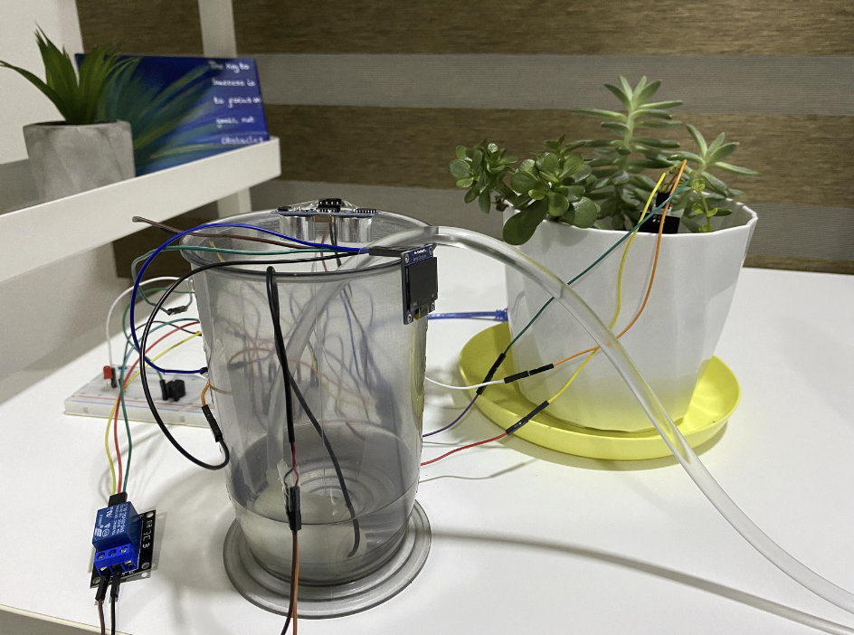

# 🌱 IoT Smart Irrigation System

A university IoT project where my teammate and I built a working smart irrigation prototype using an **ESP32**, sensors, automated watering and cloud monitoring.

The goal was to create a system that could monitor plant and water conditions in real time and make watering decisions automatically rather than relying on constant manual checking.



## 💡 What It Does

The system continuously monitors the soil and water tank.

When the soil becomes too dry, the ESP32 automatically activates a water pump through a relay to water the plant. Once sufficient moisture is detected, watering stops.

At the same time, the system monitors the water tank using an ultrasonic sensor and alerts the user if the water level becomes too low.

Sensor data is also sent to a **ThingsBoard cloud dashboard using MQTT**, allowing the system to be monitored remotely.

## ✨ Features

- Real-time soil moisture monitoring
- Automatic watering when soil becomes dry
- Stops watering once sufficient moisture is detected
- Water tank level monitoring using an ultrasonic sensor
- Buzzer alert when the tank is running low
- OLED display showing plant condition
- Real-time cloud monitoring through ThingsBoard
- Wi-Fi and MQTT communication
- ESP32-based automated control

## 🧠 How It Works

```text
Soil Moisture Sensor
        ↓
      ESP32
        ↓
 Dry soil detected
        ↓
 Relay activates pump
        ↓
   Plant is watered

Ultrasonic Sensor
        ↓
      ESP32
        ↓
 Water level monitored
        ↓
 Low level → Buzzer alert

ESP32
  ↓
Wi-Fi + MQTT
  ↓
ThingsBoard Cloud Dashboard
```

## 🔧 Hardware

- ESP32 microcontroller
- Capacitive soil moisture sensor
- HC-SR04 ultrasonic sensor
- Relay module
- 3V–5V submersible water pump
- SSD1306 OLED display
- Buzzer
- Breadboard
- Jumper wires
- Water tubing

## 💻 Software & Technologies

- Arduino IDE
- C++ / Arduino
- ESP32
- ThingsBoard IoT Platform
- MQTT
- Wi-Fi
- `WiFi.h`
- `PubSubClient.h`
- `Wire.h`
- `Adafruit SSD1306`

## ☁️ Cloud Integration

The ESP32 connects to the internet over Wi-Fi and communicates with **ThingsBoard using MQTT**.

Telemetry sent to the dashboard includes:

- Soil moisture readings
- Water tank readings
- System status information

This allowed us to monitor the prototype's conditions remotely in real time.

## 🧪 Testing

We tested each major part of the system individually and as part of the complete prototype.

For our prototype:

- A soil moisture threshold of **2400** was used to determine when watering was required.
- The pump successfully activated when dry soil was detected.
- The pump stopped once the soil became sufficiently wet.
- The ultrasonic sensor monitored the water tank level.
- A distance threshold of **10 cm** was used to detect a low water level.
- The buzzer successfully triggered when the tank level became too low.
- Sensor data was successfully transmitted to ThingsBoard.

The OLED also provided simple visual feedback:

- 😊 Sufficient soil moisture
- ☹️ Dry soil
- 😠 Water tank almost empty

## 🎥 Prototype Demonstration

A video demonstration of the working prototype shows the complete system in action, including sensor readings, automatic watering, water-level monitoring, alerts, OLED feedback and cloud integration.

**[▶ Watch the prototype demonstration](https://youtu.be/JvSVnkj47oE)**

## 👥 Project Context

This was completed as a **university group project**, so development and other project responsibilities were shared between my teammate and I.

This project gave me hands-on experience connecting **hardware, software, sensors, automation and cloud services** into one working system.

## 💭 What I Took Away From It

This project was especially useful because it went beyond writing code on a screen.

We had to make several physical and software components communicate with each other, troubleshoot sensor readings and wiring, control real hardware, and then connect the finished system to a cloud platform.

It helped me understand how an IoT system actually fits together from **sensing → processing → actuation → communication**, and how software can interact directly with the physical world.

## 🚀 Potential Improvements for the Future

Some ideas we identified for improving the system further:

- Weather API integration to avoid watering when rain is expected
- Water usage analytics
- Better power management for long-term deployment
- Mobile application for remote monitoring and control

## 📁 Repository Structure

```text
iot-smart-irrigation-system/
├── README.md
├── prototype.jpg
├── Smart_Irrigation_System.ino
└── demo/
    └── prototype-demo.mp4
```
